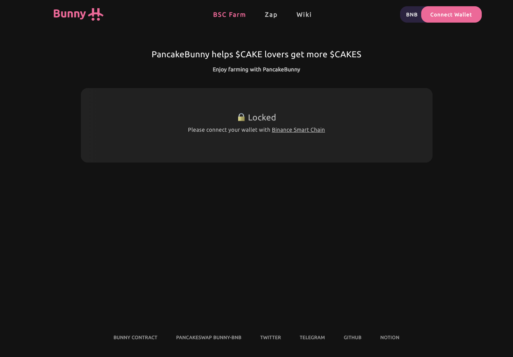

************************
Step-By-Step Guides
************************

How to Farm using Bunny
================================================

-step by step guide making the experience as user friendly as possible

Prerequisites
================================================

You must have a specific Farm’s underlying token. For CAKE-BNB, you need CAKE tokens and BNB tokens. The same for other respective farms.

You must have a supported wallet, either metamask, or Walletconnect!

Walkthrough
================================================

1. Go to pancakebunny.finance/ and click “Connect Wallet”

2. Click either the Metamask or WalletConnect Icon depending on what you use
3. Select the Farm you want to invest in
4. You need Flip Tokens (LP Tokens) (CAKE-BNB Flip, BUSD-BNB Flip, etc)
5. After receiving FLIP Tokens, enter the amount of tokens you want to deposit and click “Deposit”
6. Confirm the transaction with Metamask or WalletConnect
7. View the transaction on BscScan and await the confirmation
8. Congrats! You have now joined the Bunny Farm!
